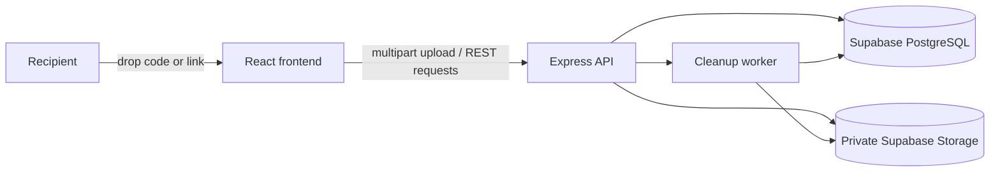

# NoteDrop

### Temporary file sharing with a code, a link, and no account required.

[](https://react.dev/)
[](https://vite.dev/)
[](https://nodejs.org/)
[](https://expressjs.com/)
[](https://www.postgresql.org/)
[](https://supabase.com/)

NoteDrop is a temporary file-sharing application for sending documents through a short, backend-generated drop code or shareable URL. Files are stored privately in Supabase Storage, while PostgreSQL stores the metadata and access rules.

> 🎓 Built as a focused full-stack college and portfolio project: simple for recipients, deliberate about expiry, access control, and cleanup.

---

## ✨ Features

- 📤 Upload supported documents without creating an account
- 🔑 Secure, uppercase drop codes generated by the backend
- 🔗 Shareable recipient URLs such as `/d/ABC123`
- 🔒 Optional bcrypt-backed password protection
- ⏳ Server-authoritative expiration with a frontend countdown
- 📥 Configurable download limits, including unlimited downloads
- 🧹 Automatic cleanup of expired drops every minute
- 🗑️ Delete-after-first-download support
- 🛡️ Private Supabase Storage with short-lived signed access handled server-side
- 🚦 Rate limiting, Helmet security headers, CORS, and multipart validation
- 📱 Responsive React interface with light and dark themes

## 🧭 How It Works

1. Select a supported file and choose its expiry, download limit, and optional password.
2. The backend validates the multipart request and generates a secure drop code.
3. The file is uploaded to private Supabase Storage under a random storage path.
4. PostgreSQL stores safe metadata and access rules; secrets and password hashes are never returned to recipients.
5. Share the generated code or link with the recipient.
6. The backend checks expiry, password authorization, and download limits before each download.
7. A cleanup worker removes expired files and updates their database records.



## 🧱 Tech Stack

| Layer | Technology |
| --- | --- |
| Frontend | React 19, Vite, React Router, Axios, Tailwind CSS, Framer Motion, Lucide |
| Backend | Node.js, Express.js, JavaScript (ES modules) |
| Database | PostgreSQL hosted by Supabase, accessed with `pg` |
| File storage | Private Supabase Storage bucket |
| Uploads | Multer with memory storage and server-side validation |
| Passwords | bcrypt hashes; plaintext passwords are not stored |
| Security | Helmet, CORS, express-rate-limit, dotenv |
| Cleanup | node-cron worker running every minute |

## 🚀 Local Setup

### Prerequisites

- Node.js 18 or newer
- npm
- A Supabase project
- Access to the Supabase SQL editor and Storage settings

### 1. Clone and install

```bash
git clone https://github.com/AdityaKarippadathUdai/NoteShare.git
cd NoteShare

cd backend
npm install

cd ../Frontend
npm install
```

### 2. Configure the backend

Create `backend/.env` from [backend/.env.example](backend/.env.example):

```bash
cp backend/.env.example backend/.env
```

Fill in the real values locally. Never commit this file.

```env
PORT=8000
NODE_ENV=development
FRONTEND_URL=http://localhost:3000

DATABASE_URL=
DIRECT_URL=

SUPABASE_URL=
SUPABASE_SECRET_KEY=
SUPABASE_STORAGE_BUCKET=notedrop-files

MAX_FILE_SIZE_MB=50
CLEANUP_INTERVAL_MS=60000
```

`SUPABASE_SECRET_KEY` is server-only. Do not expose it through frontend `VITE_` variables.

### 3. Configure the frontend

Create `Frontend/.env` from [Frontend/.env.example](Frontend/.env.example):

```bash
cp Frontend/.env.example Frontend/.env
```

For local development:

```env
VITE_API_URL=http://localhost:8000/api
```

Only public frontend configuration belongs in `Frontend/.env`.

### 4. Initialize PostgreSQL

Run [database/schema.sql](database/schema.sql) in the Supabase SQL editor. It creates the `drops` table and indexes without inserting demo rows.

The schema includes metadata for:

- Generated code and original filename
- Random storage filename and private storage path
- MIME type and file size
- Creation and expiration timestamps
- Download limits and current count
- Password hash and deletion policy
- Drop status and management-token hash

### 5. Create private Storage

In Supabase Dashboard:

1. Open **Storage**.
2. Create a bucket named `notedrop-files`.
3. Keep the bucket private.
4. Do not expose the service secret or create unrestricted public file URLs.

The backend uses the server-side Supabase secret to upload, remove, and create short-lived signed URLs.

## ▶️ Run the App

Open two terminals from the repository root.

### Backend

```bash
npm --prefix backend run dev
```

The API runs at `http://localhost:8000`.

Production-style start:

```bash
npm --prefix backend start
```

Run the cleanup worker by itself when needed:

```bash
npm --prefix backend run cleanup
```

### Frontend

```bash
npm --prefix Frontend run dev
```

The frontend runs at `http://localhost:3000`.

Build and preview the frontend:

```bash
npm --prefix Frontend run build
npm --prefix Frontend run preview
```

## 🔌 API Overview

All API routes use the `/api` prefix.

| Method | Endpoint | Purpose |
| --- | --- | --- |
| `GET` | `/api/health` | Service health check |
| `POST` | `/api/drops` | Create a drop with `multipart/form-data` |
| `GET` | `/api/drops/:code` | Retrieve safe drop metadata |
| `POST` | `/api/drops/:code/verify` | Verify a protected drop password |
| `GET` | `/api/drops/:code/download` | Authorize and download a file |
| `DELETE` | `/api/drops/:code` | Delete a drop with its management token |

### Create a drop

`POST /api/drops` expects multipart form data:

| Field | Values |
| --- | --- |
| `file` | One supported file |
| `expiresIn` | `10m`, `30m`, `1h`, or `24h` |
| `maxDownloads` | A positive limit or `unlimited` |
| `password` | Optional password |
| `deleteAfterFirstDownload` | `true` or `false` |

Successful responses contain safe public metadata under `drop`. The private management token is returned only at creation time and is not part of the shareable URL.

### Error responses

Errors use a structured shape:

```json
{
  "success": false,
  "error": {
    "code": "DROP_EXPIRED",
    "message": "This drop has expired."
  }
}
```

Common codes include `DROP_NOT_FOUND`, `DROP_EXPIRED`, `DROP_DELETED`, `PASSWORD_REQUIRED`, `INVALID_PASSWORD`, `DOWNLOAD_LIMIT_REACHED`, `INVALID_FILE_TYPE`, and `FILE_TOO_LARGE`.

## 📄 Supported Files and Limits

Supported extensions:

- `.pdf`
- `.doc`
- `.docx`
- `.pptx`
- `.txt`
- `.zip`

The backend enforces a maximum upload size of 50 MB. It validates the extension and MIME type server-side; browser validation is not trusted.

## ⏱️ Expiry and Download Limits

- Expiry is calculated by the backend using server time.
- The frontend countdown is informational only.
- Expired drops return `DROP_EXPIRED` and HTTP 410.
- A configured download limit is checked atomically inside a PostgreSQL transaction.
- Once the limit is reached, further downloads return `DOWNLOAD_LIMIT_REACHED` and HTTP 403.
- Unlimited drops use a null `max_downloads` value.
- `deleteAfterFirstDownload` marks the drop unavailable and removes its stored file after a successful first download.

## 🔐 Password-Protected Drops

Passwords are hashed with bcrypt before storage. A recipient first loads the drop by code, then submits the password to:

```text
POST /api/drops/:code/verify
```

After successful verification, the frontend keeps the entered password only in memory and sends it in a protected request header for the download request. Passwords are not placed in shareable URLs or persisted in browser storage.

## 🧹 Automatic Cleanup

The built-in node-cron worker runs every minute:

1. Finds active drops whose server-side expiry has passed.
2. Removes their files from private Supabase Storage.
3. Marks their database records as expired.
4. Continues processing if an individual file or record fails.

Cleanup is safe to run repeatedly and does not create the database schema automatically. Apply the SQL schema before starting the application.

## 🗂️ Project Structure

```text
NoteShare/
├── Frontend/
│   ├── src/
│   │   ├── components/
│   │   ├── context/
│   │   ├── hooks/
│   │   ├── pages/
│   │   ├── services/
│   │   └── utils/
│   ├── .env.example
│   └── package.json
├── backend/
│   ├── src/
│   │   ├── config/
│   │   ├── controllers/
│   │   ├── middleware/
│   │   ├── routes/
│   │   ├── services/
│   │   ├── utils/
│   │   ├── workers/
│   │   ├── app.js
│   │   └── server.js
│   ├── .env.example
│   └── package.json
├── database/
│   └── schema.sql
└── README.md
```

## 🛡️ Security Notes

- Keep `backend/.env` out of version control.
- Never expose `SUPABASE_SECRET_KEY` to React or any `VITE_` variable.
- Keep the Storage bucket private.
- Files use random storage names; original filenames are stored as metadata only.
- Passwords are hashed and never returned by the API.
- Internal database IDs, storage credentials, password hashes, and management-token hashes are not exposed to recipients.
- Server-side expiry, password, and download-limit checks are authoritative.
- Helmet, CORS, request-size limits, upload validation, and rate limiting protect the API surface.

## 🧪 Example Workflow

```text
1. Start Supabase and apply database/schema.sql
2. Configure backend/.env and Frontend/.env
3. Start backend on :8000
4. Start frontend on :3000
5. Select a PDF and choose 30m expiry + 3 downloads
6. Optionally add a password
7. Create the drop
8. Share http://localhost:3000/d/<generated-code>
9. Recipient enters the password if required
10. Backend authorizes and serves the file
11. Expired or exhausted drops become unavailable automatically
```

## 🔭 Future Improvements

Possible next steps that fit the current architecture:

- Automated integration tests for Supabase-backed upload and download flows
- A dedicated migration runner for versioned database changes
- Resumable uploads for larger files
- Optional observability and structured request logging without sensitive data
- Stronger short-lived verification tokens instead of re-presenting the password header
- Deployment profiles for a hosted frontend and backend


